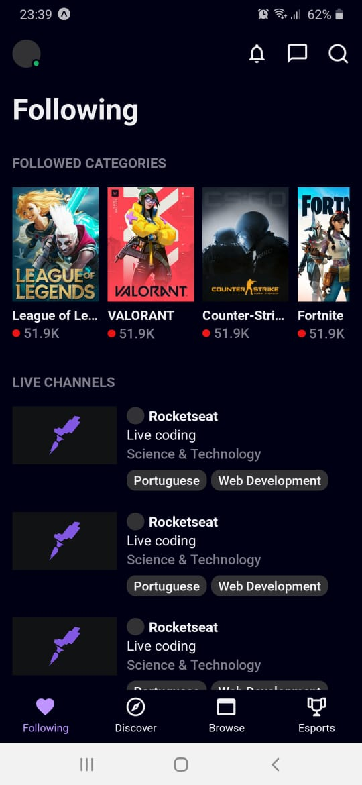
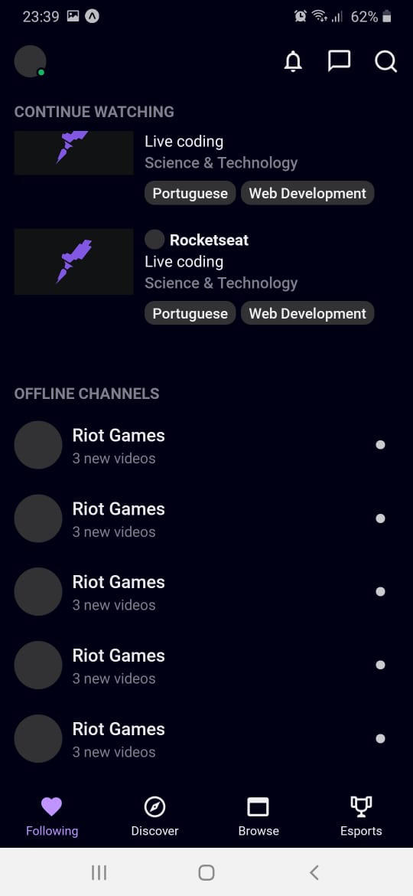

## <div align="center"></div>

###

<div align="center">


</div>

<p align="center">📺 A clone of Twitch's mobile app homepage</p>

## 🛠️ Technologies

<ul>
  <li><a href="https://reactnative.dev/docs/getting-started">React Native</a></li>
  <li><a href="https://styled-components.com/">Styled Components</a></li>
  <li><a href="https://www.typescriptlang.org/">TypeScript</a></li>
  <li><a href="https://expo.io">Expo</a></li>
  
</ul>

## ⚙️ Requirements

<ul>
  <li><a href="https://git-scm.com/">Git</a></li>
  <li><a href="https://nodejs.org/en/">Node.js</a></li>
  <li><a href="https://yarnpkg.com/">Yarn</a></li>
  <li><a href="https://expo.io/tools">Expo App</a></li>
</ul>

## 🚀 Installation

```bash
$ git clone https://github.com/gabrielsanttana/twitch
$ cd twitch
$ yarn
$ yarn start
```

A new window with the application log will open in the browser

Then, you can simply load the app by scanning the QR code with the Expo mobile app or by using the local URL

## ⚖️ License

[MIT License](https://github.com/gabrielsanttana/twitch/blob/master/LICENSE)

<h6 align="center">Made with ❤️ by <a href="https://linkedin.com/in/gabrielsanttana">Gabriel Santana</a></h6>
